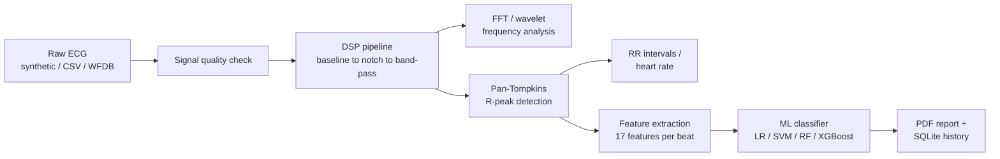

# CardioDSP Lab — Intelligent ECG Signal Analysis

An academic biomedical signal-processing platform that takes a raw ECG
recording through a **visible, stage-by-stage** pipeline — filtering,
frequency analysis, R-peak detection, feature extraction, and rhythm
classification — instead of hiding everything behind a single "AI verdict."

> **Academic prototype — not a medical device.** This project is for
> education and research. It is not certified, not clinically validated,
> and must never be used for diagnosis, treatment, or emergency decisions.
> See [Limitations & disclaimer](#limitations--disclaimer).

## What it does

1. **Load** a recording — a built-in synthetic generator (4 rhythm
   scenarios), an uploaded CSV, or a real WFDB record (`.dat`/`.hea`/`.atr`,
   e.g. from MIT-BIH)
2. **Assess signal quality** (flatline / saturation / noise checks)
3. **DSP pipeline**: baseline-wander removal → mains-notch filter →
   band-pass filter, with every intermediate stage plotted
4. **Frequency-domain view**: FFT magnitude spectrum, optional CWT
   wavelet scalogram
5. **R-peak detection** via a from-scratch Pan–Tompkins implementation,
   with RR-interval / heart-rate-variability metrics
6. **Feature extraction**: 17 temporal, morphological, statistical, and
   spectral features per beat
7. **Classification**: Logistic Regression, SVM, Random Forest, and
   XGBoost, trained on **AAMI N/S/V/F** beat classes
8. **Reporting**: PDF report generation + a SQLite run history

## Architecture



```
app.py                    Streamlit entry point, theme, page routing
src/
  data_loader.py          Synthetic ECG generator, CSV loader, MIT-BIH download/load
  mitbih_data.py          AAMI label mapping, real-data feature extraction
  preprocessing.py        Baseline/notch/band-pass filters, input validation
  signal_analysis.py      Pan-Tompkins detector, RR/HRV, FFT, wavelets
  signal_quality.py       Flatline/saturation/noise checks
  feature_extraction.py   Per-beat feature engineering
  ml_training.py          Model training (synthetic / real / both), evaluation
  prediction.py           Loads trained models, runs inference
  explainability.py       Feature-importance / clinical-style explanation text
  pipeline.py             Wires the above into one run_full_analysis() call
  report_generator.py     PDF report generation
  history_db.py           SQLite run history
  ui_pages.py              All Streamlit page layouts
download_mitbih.py        One-command script to fetch real recordings
tests/test_pipeline.py    pytest suite (DSP, features, validation, AAMI mapping)
```

## Quick start (synthetic data — works fully offline)

```bash
python -m venv venv
source venv/bin/activate        # Windows: venv\Scripts\activate
pip install -r requirements.txt
streamlit run app.py
```
Open the app, click **Analyze demo ECG**, then walk through
**DSP Analysis to ECG Features to ML Prediction**. Models are already
trained on synthetic data, so this works with zero setup.

## Training on real recordings (MIT-BIH Arrhythmia Database)

```bash
python download_mitbih.py                 # ~15 MB, 8 records
python -m src.ml_training --source both    # real + synthetic (recommended)
```
See [RUN_GUIDE.md](RUN_GUIDE.md) for the full walkthrough, including the
full 44-record AAMI benchmark set (`--full`) and what each `--source`
option does.

Real beat labels come from the database's own cardiologist annotations
(not re-detected), mapped to AAMI EC57 superclasses. The train/test split
is done **per patient record**, so no patient's beats leak between train
and test.

## Deployment

See [DEPLOYMENT.md](DEPLOYMENT.md) for step-by-step instructions to get a
public Streamlit Community Cloud link from this repo.

## Tests

```bash
pytest tests/ -v
```
22 tests covering the DSP pipeline, R-peak detection, feature extraction,
input validation (empty/short/NaN/flat signals, malformed CSVs), the AAMI
label mapping, and the SQLite history log.

## Dataset

Primary real-data source: [MIT-BIH Arrhythmia Database](https://physionet.org/content/mitdb/1.0.0/)
(Moody & Mark, PhysioNet, ODC-BY license). Not committed to this repo —
run `download_mitbih.py` to fetch it yourself.
`data/sample/demo_ecg.csv` is a small synthetic sample, not a clinical
recording.

## Limitations & disclaimer

- **Not a medical device.** No regulatory review, no clinical validation,
  no physician-in-the-loop design.
- **Beat-level classification only**, on 4 classes (N/S/V/F) — this is
  not a full arrhythmia diagnosis, rhythm interpretation, or 12-lead
  analysis.
- Real-data performance depends entirely on how many MIT-BIH records you
  train on; the 8-record quick set is for pipeline verification, not a
  number to report as "accuracy."
- Trained on a single public database (MIT-BIH), collected decades ago on
  a specific patient population — it will not generalize to arbitrary
  real-world ECG hardware or populations without further validation.

Classification results should never be interpreted outside of an academic
context, and never by anyone without the training to independently assess
them.

## For your viva / project defense

**Q: Why keep every DSP stage visible instead of just showing the final
classification?**
A design choice, not a limitation — a black-box "ECG in, diagnosis out"
tool can't be evaluated or trusted. Showing baseline correction, notch
filtering, band-pass filtering, the FFT spectrum, and the R-peak detector
output separately lets you (and anyone reviewing the project) verify each
stage did what it claims, and see exactly where the pipeline would fail
on bad input.

**Q: How is R-peak detection done?**
A from-scratch implementation of the Pan–Tompkins algorithm (band-pass to
derivative to squaring to moving-window integration to adaptive
thresholding), not a library call — see `src/signal_analysis.py`.

**Q: What features feed the classifier, and why those?**
17 features per beat: RR-interval timing (pre/post/ratio/local mean),
statistical shape (mean, variance, skewness, kurtosis, energy),
morphology (R height, Q/S depth, QRS amplitude/duration), and spectral
(dominant frequency, spectral entropy). This mirrors the feature families
used in the published MIT-BIH beat-classification literature (de Chazal
et al. and similar).

**Q: How do you avoid patient leakage inflating your accuracy?**
The train/test split is done per patient record (`record_id`), not per
beat — every beat from one patient stays entirely in train or entirely in
test. Mixing a patient's beats across both sets is a known way these
models silently produce misleadingly high accuracy.

**Q: What happens on a bad or corrupted input file?**
`src/preprocessing.py::validate_ecg_signal` rejects empty, too-short,
NaN/Inf-containing, or flat-line signals with a specific error message
before they reach the filters — see `tests/test_pipeline.py` for the
exact cases covered.